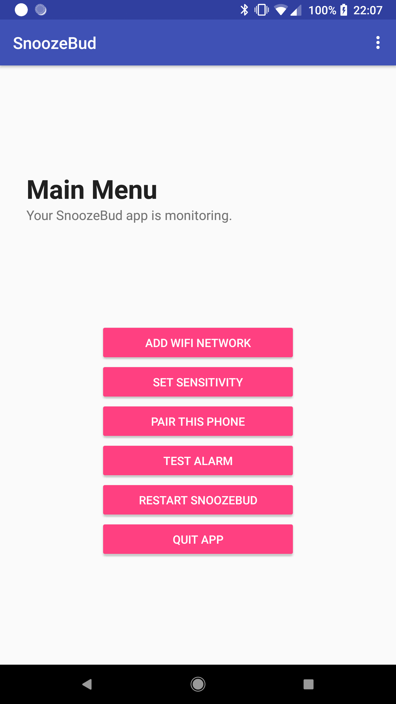
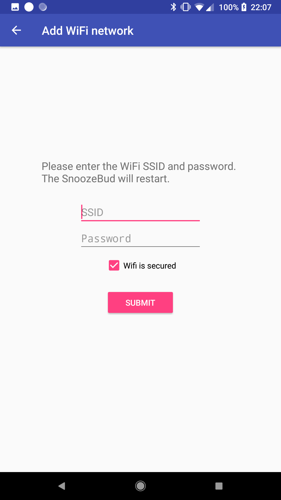
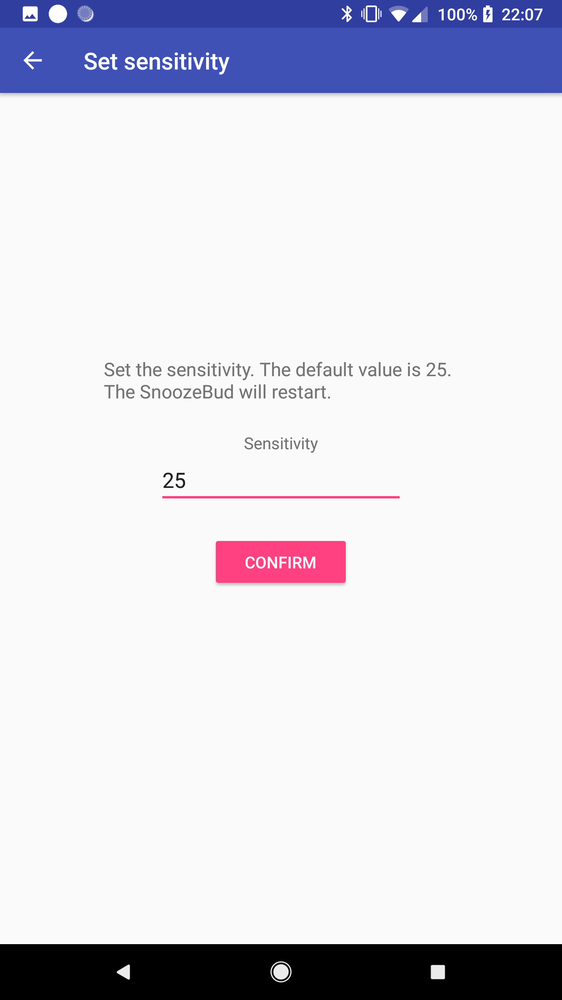
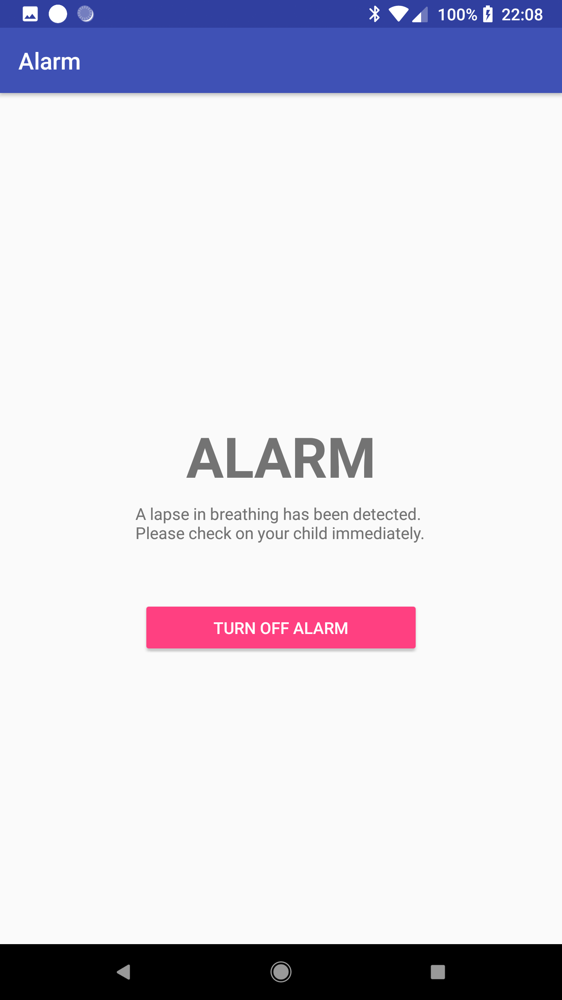

# SnoozeBud

This repo holds the code for the SnoozeBud Android app. SnoozeBud is a non-invasive breathing monitoring system for infants. When the SnoozeBud detects a lapse in breathing, an alert is sent to the Android app via Firebase.

## App functionality

The app has the ability to:
* Configure the SnoozeBud's WiFi network
* Set sensitivity of SnoozeBud sensors
* Pair the current phone to the SnoozeBud
* Test the alarm
* Restart the SnoozeBud device
* Quit app / stop monitoring

## Interfacing with SnoozeBud device
The SnoozeBud is built on a Raspberry Pi. One of the challenges was that we had no screen or input method on the Raspberry Pi to perform the initial setup (connecting the device to WiFi and pairing the phone).

The method used is to connect the SnoozeBud via ethernet to the local network. Then, the Android app can open an SSH communication channel with the SnoozeBud to send WiFi details, at which point the SnoozeBud can be disconnected from ethernet.

Firebase Cloud Messaging is used for communication from the SnoozeBud to the Android app. When the app receives a Firebase message from the SnoozeBud, the alarm is triggered.

## Screenshots
 
 
 
 
